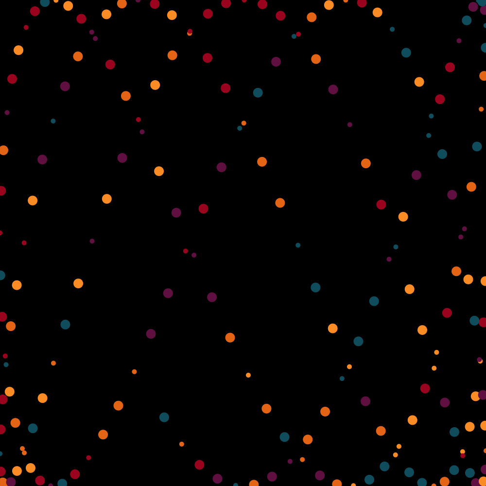
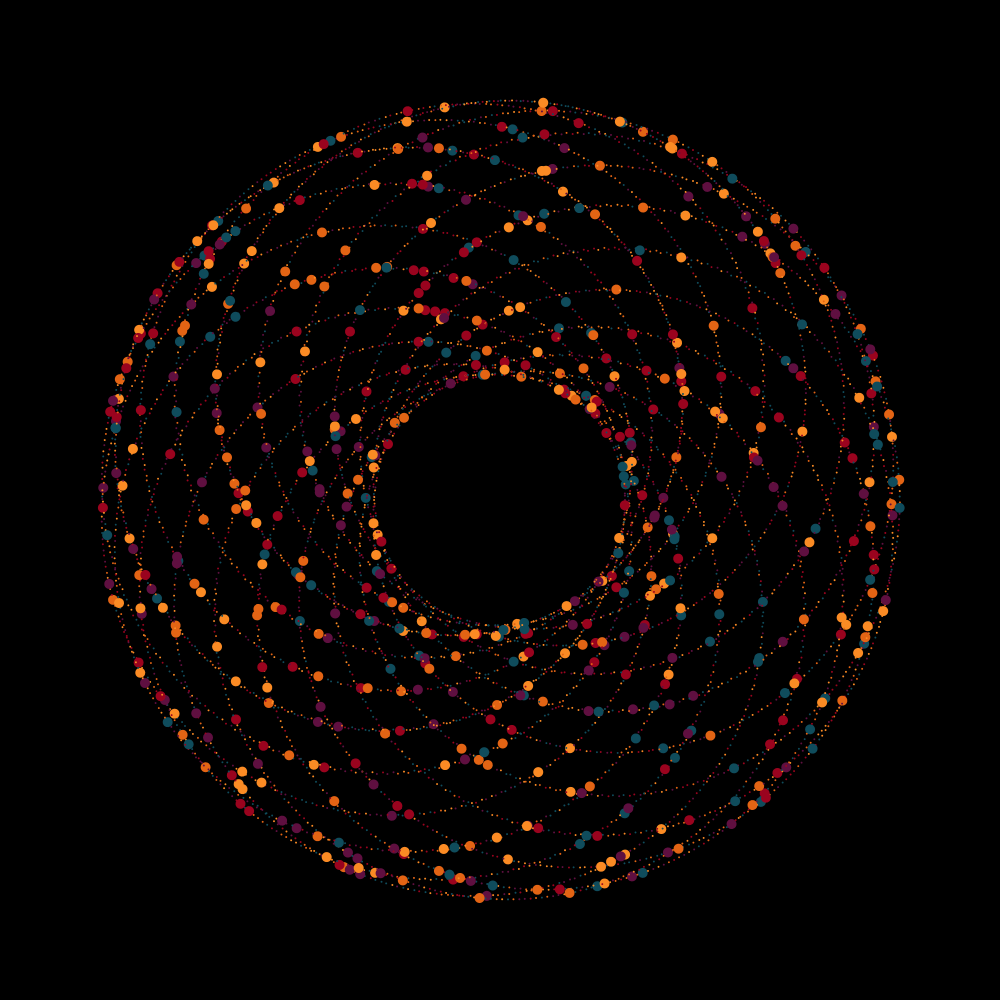
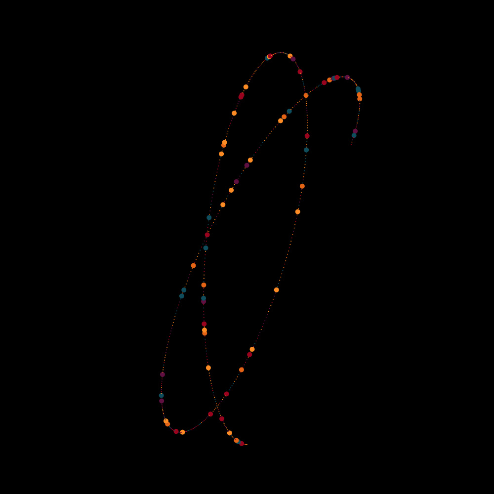

# Paint Can Swing Emulator
[Inspired by these kinds of things]("https://www.instagram.com/p/B6qn2NyBdEd/?utm_source=ig_web_button_share_sheet")
## Iteration 01
Got the math wrong here, but I wasn't too sad with the result. Draws a paint dot every 5 frames with some randomness to the blotSize




## Iteration 02
Switched to using relative coordinates
```
pushMatrix();
translate(width/2, height/2);
rotate(globA);
popMatrix();
```



## Iteration 03
Found a good ratio of swing rate to global ratio to get less circular paint dots



