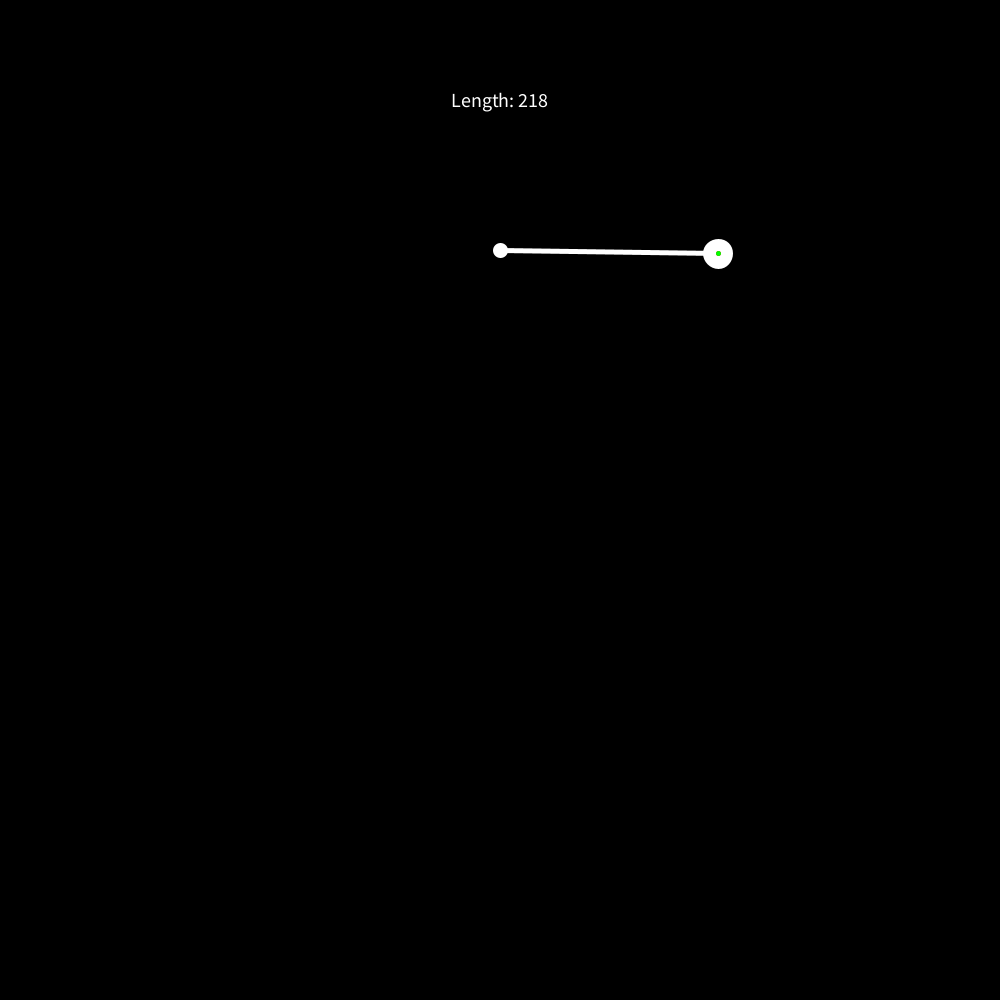

# Paint Can Swing Emulator

[Inspired by these kinds of things]("https://www.instagram.com/p/B6qn2NyBdEd/?utm_source=ig_web_button_share_sheet")

## Iteration 01

Got the math wrong here, but I wasn't too sad with the result. Draws a paint dot every 5 frames with some randomness to the blotSize


## Iteration 02

Switched to using relative coordinates

```
pushMatrix();
translate(width/2, height/2);
rotate(globA);
popMatrix();
```


## Iteration 03

Found a good ratio of swing rate to global ratio to get less circular paint dots


## Iteration 04

Set it to draw an ellipse every frame


## Iteration 05

Playing with transparency and also using a gaussian random number for the size of the blot


## Iteration 05_01

Introduce epicycles


## Iteration 06

Perlin noise for the size of the blots and increased epicycle rotation


## Iteration 07

Perlin noise for the rotation of the epicycle


## Iteration 08

A naive attempt at a physics simulation - Vector addition too imprecise? It either reels in or spools out. Feel free to fork and fix if you please =)



## Iteration 08_01

Borrowed from Daniel Shiffman. More work required on the initial velocity, but I think it's a pretty interseting place to start.


