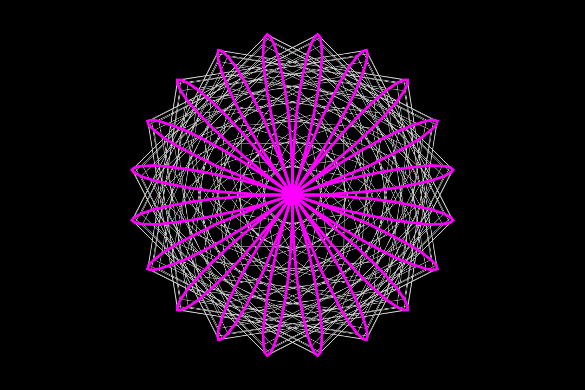
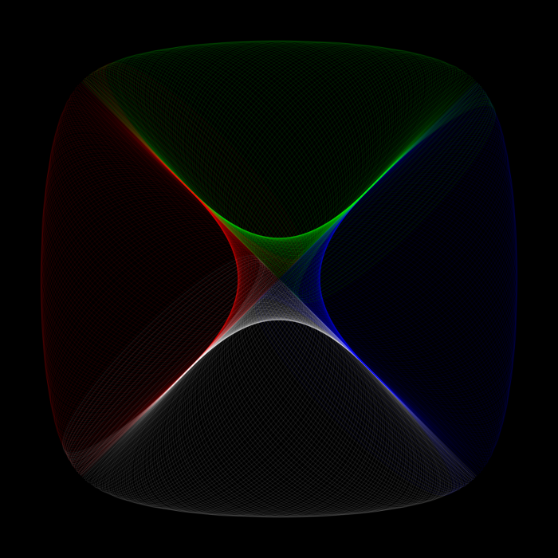
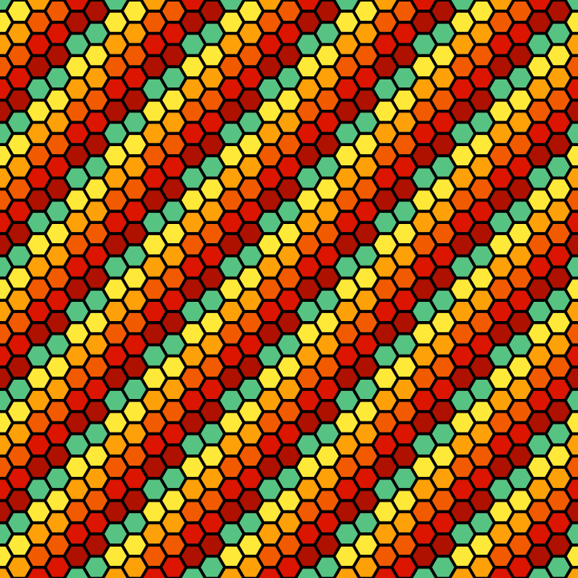
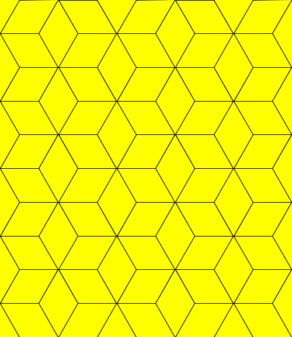
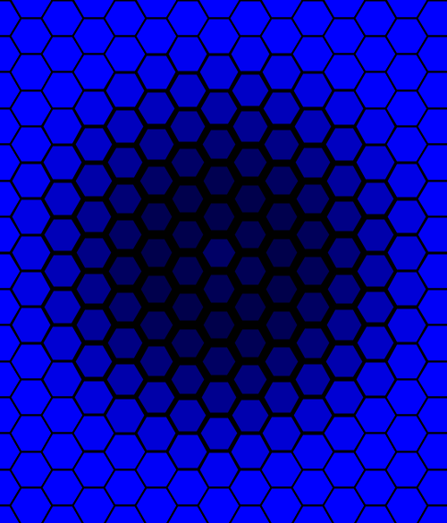

# Creative-Coding-Processing
Creative Coding Projects written in Processing. Mostly in progress.
## [AltLines](AltLines)

## [Geometrical_Study](Geometrical_Study)

## [IK Walker](IK%20Walker)

## [Nearest Neighbour Study](Nearest%20Neighbour%20Study)

## [Nuclear Reactor Sim](Nuclear%20Reactor%20Sim)

## [Organic_Study](Organic_Study)

## [Paint Can Swing Emulator](Paint%20Can%20Swing%20Emulator)

## [Periodic Motion Study](Periodic%20Motion%20Study)

## [Perlin Noise Study](Perlin%20Noise%20Study)

## [Reverse Engineering Study](Reverse%20Engineering%20Study)

## [Rock Scissors Paper](Rock%20Scissors%20Paper)

## [Streak Art](Streak%20Art)

## [Tilings](Tilings)

## [Tribesmen](Tribesmen)

